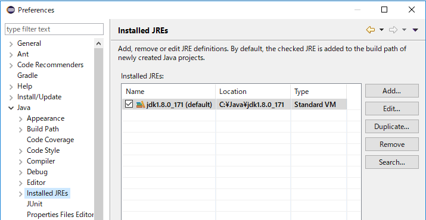
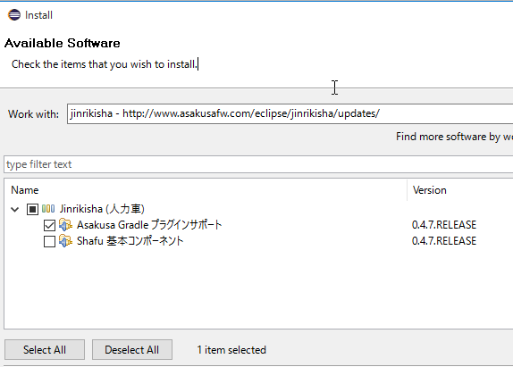
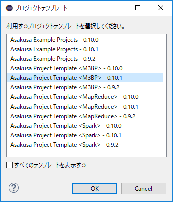
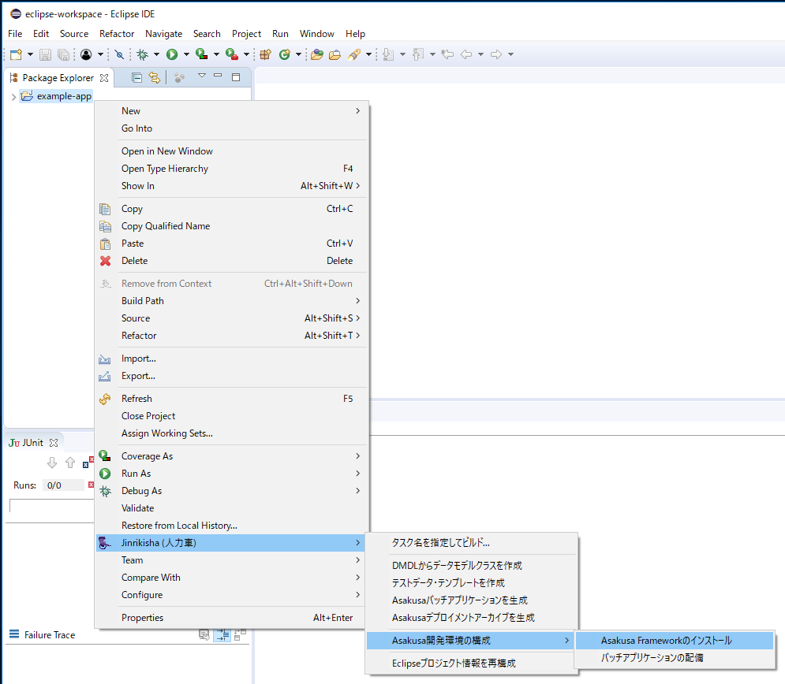
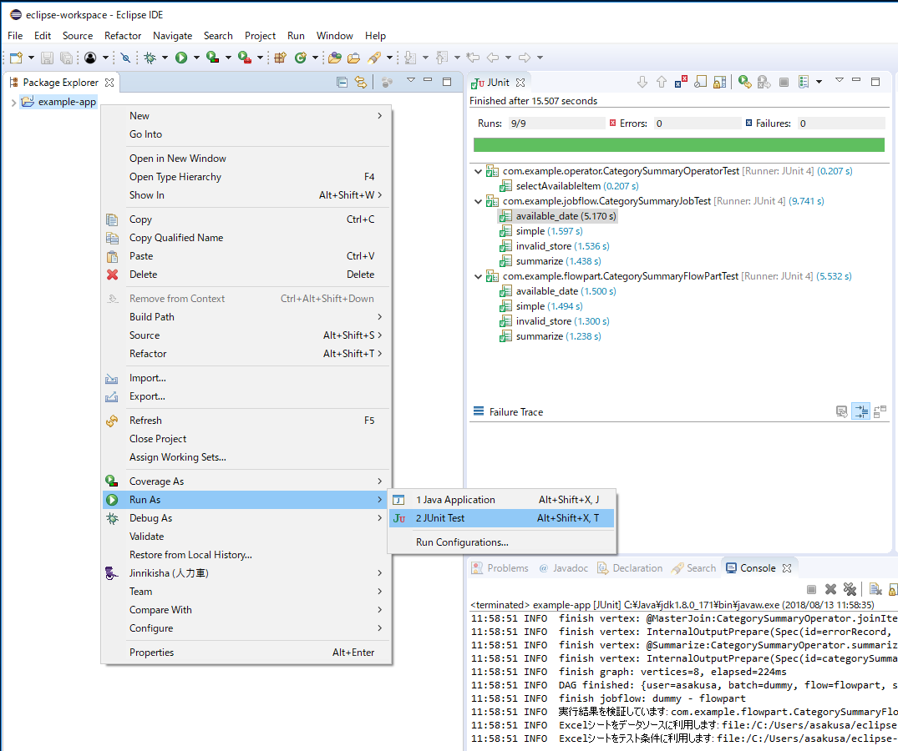

===================================================
Shafu - Asakusa Gradle Plug-in Helper for Eclipse -
===================================================

Shafu (車夫) は、 `Asakusa Framework`_ のバッチアプリケーション開発をサポートするEclipseプラグインです。

Shafu は バッチアプリケーション開発にGradleを利用する際に、Eclipseから透過的にビルドツール上の操作を行えます。
Shafuを使うことで、ターミナル上でのビルドツールの操作が不要となり、Eclipse上でアプリケーション開発に必要なほとんどの作業を行うことができるようになります。

Shafu は Jinrikisha でセットアップしたEclipse環境ではもちろんのこと、単体でセットアップしたEclipse上での利用も可能です。

..  _`Asakusa Framework`: http://docs.asakusafw.com/latest/release/ja/html/index.html

..  note::
    Asakusa Frameworkが提供するGradle上のビルド機能についての詳細は、Asakusa Frameworkのドキュメント `Asakusa Gradle Plugin ユーザガイド`_ を参照してください。

..  _`Asakusa Gradle Plugin ユーザガイド`: http://docs.asakusafw.com/latest/release/ja/html/application/gradle-plugin.html

対応プラットフォーム
====================

Shafuは以下のプラットフォームで動作を検証しています。

..  list-table::
    :widths: 2 3 2 3
    :header-rows: 1

    * - プラットフォーム
      - ソフトウェア
      - バージョン
      - 備考
    * - IDE
      - Eclipse
      - 4.7.1a
      -
    * - Java
      - Oracle JDK
      - JDK7 / JDK8
      - 推奨環境
    * - Java
      - Open JDK
      - JDK7 / JDK8
      - 基本的な動作確認のみ
    * - OS
      - Ubuntu Desktop
      - 16.04.3
      - 推奨環境
    * - OS
      - CentOS
      - 7.2
      -
    * - OS
      - MacOSX
      - 10.13
      -
    * - OS
      - Windows
      - 10 (1709)
      -

..  attention::
    Asakusa Frameworkのバッチアプリケーションのコンパイルやテストの実行にはJDKが必要です。
    JREのみがインストールされている環境では利用できません。

環境変数の設定
--------------

Shafuから利用する一部の機能は、以下の環境変数が必要です。

..  list-table::
    :widths: 3 7
    :header-rows: 1

    * - 変数名
      - 説明
    * - ``ASAKUSA_HOME``
      - Asakusa Frameworkのインストールディレクトリ

Eclipseの設定
-------------

Asakusa Frameworkの開発環境向けにEclipseの設定を行います。

以降の設定はEclipseの設定画面から行います。
Eclipseのメニューバーから :menuselection:`Window --> Preferences` で設定画面を表示します。

JDKの登録
~~~~~~~~~

Eclipse経由で実行するJavaにJREが設定されている場合は、これをJDKに設定します。

1. Eclipseの設定画面から :menuselection:`Java --> Installed JREs` を選択します。
2. :guilabel:`Installed JREs` ダイアログにJDK以外のJava定義が表示されている場合 (例えば ``jre8`` のような項目が表示されている場合)、これら項目を削除します。 削除する項目を選択して、 :guilabel:`Remove` ボタンを押下します。
3. JDKを追加します。 :guilabel:`Installed JREs` ダイアログで :guilabel:`Add` ボタンを押下します。
4. :guilabel:`JRE Type` ダイアログで :guilabel:`Standard VM` を選択し、 :guilabel:`Next >` ボタンを押下します。
5. :guilabel:`JRE Definition` ダイアログで :guilabel:`JRE home:` の項目右の :guilabel:`Directory...` ボタンを押下し、JDKのフォルダを指定します。
6. :guilabel:`JRE Definition` ダイアログの各項目にインストールしたJDKの情報が設定されたことを確認して :guilabel:`Finish` ボタンを押下します。
7. :guilabel:`Installed JREs` ダイアログに追加したJDKの項目が表示されるので、その項目の :guilabel:`Name` 欄に表示されているチェックボックスを :guilabel:`ON` にします。JDKの項目が ``jdk1.8.0_XX (default)`` のような表示になれば設定完了です。

..  attention::
  Asakusa Frameworkのバッチアプリケーションのコンパイルやテストの実行にはJDKを使用する必要があります。
  JREを使用することはできないため、ここで示す手順以外でJDKの設定を行う場合、誤ってJREが使用されるような設定にならないよう注意してください。

ネットワークプロキシの設定
~~~~~~~~~~~~~~~~~~~~~~~~~~

オンラインとの接続にプロキシサーバを経由する必要がある場合は、Eclipseのプロキシ設定画面でプロキシの設定を行います。

1. メインメニューから :menuselection:`Window --> Preferences` を選択します。
2. プリファレンス画面のサイドメニューから :menuselection:`General --> Network Connections` を選択します。
3. プロキシ設定画面で、 :guilabel:`Active Provider:` を ``Manual`` に変更し、 :guilabel:`Proxy entries` や :guilabel:`Proxy bypass` の内容を編集して :guilabel:`OK` ボタンを押します。

Shafuのインストール
===================

Eclipse上でShafu のアップデートサイトを利用したインストール手順例を説明します。

1. Eclipseのメニューから :menuselection:`Help --> Install New Software...` を選択します。
2. Install ダイアログで :guilabel:`Work with:` の項目右の :guilabel:`Add` ボタンを押下します。

3. Add Repository ダイアログに以下の値を入力します。

..  list-table::
    :widths: 2 5

    * - :guilabel:`Name:`
      - ``Jinrikisha``
    * - :guilabel:`Location:`
      - ``http://www.asakusafw.com/eclipse/jinrikisha/updates/``

4. Install ダイアログに表示された ``[Jinrikisha (人力車)]`` カテゴリを展開して ``[Asakusa Gradle プラグインサポート]`` を選択し、 :guilabel:`Next >` ボタンを押下します。

5. 以降、画面の指示に従いインストールを進めます。Eclipseの再起動を促されたら :guilabel:`Yes` を選択します。
6. Eclipse再起動が完了したら、Javaパースペクティブを表示して メニューバーから :menuselection:`Window --> Perspective --> Reset Perspective..` を選択して :guilabel:`Java` パースペクティブを初期化します。

..  attention::
    Shafuのインストール後にJavaパースペクティブの初期化を行わないと、Shafuのメニューが表示されないことがあります。

Shafuの使い方
=============

Shafu が提供する各機能の使い方を説明します。

Gradleプロジェクトをテンプレートから生成
----------------------------------------

オンライン上に公開されているAsakusa Frameworkのプロジェクトテンプレートや、ローカルに配置したプロジェクトテンプレートを利用して、Eclipse上に新規プロジェクトを作成することができます。

1. Javaパースペクティブ上のメインメニューなどから :menuselection:`File --> New --> Gradleプロジェクトをテンプレートから生成` を選択します。
2. 新規プロジェクト情報ダイアログで、プロジェクト名などを入力します。
3. プロジェクトテンプレートの選択ダイアログで、オンラインまたはローカルのテンプレートファイルを指定します。URL入力ボックス右の :guilabel:`選択` ボタンを押すと、オンラインに公開されているプロジェクトテンプレートを一覧から選択することができます。

4. :guilabel:`Finish` ボタンを押すと選択したプロジェクトテンプレートを読み込み、Eclipseプロジェクトとして新規プロジェクトが作成されます。

Gradleプロジェクトのインポート
------------------------------

ローカルに配置したGradleベースのプロジェクトをEclipseワークスペース上にインポートすることができます。
単体のプロジェクトをインポートするほか、複数のプロジェクトから構成されるマルチプロジェクト構成のプロジェクトを一括してインポートすることもできます。

1. Javaパースペクティブ上のメインメニューなどから :menuselection:`File --> Import` を選択します。
2. インポート選択画面で :menuselection:`Jinrikisha (人力車) --> Gradle プロジェクト` を選択して :guilabel:`Next >` ボタンを押します。
3. プロジェクトディレクトリーの選択ダイアログで、ローカルに配置されているGradleプロジェクトのディレクトリーパスを選択して :guilabel:`Next >` ボタンを押します。
4. インポート対象のプロジェクト選択で、インポート対象のプロジェクトを選択して :guilabel:`Finish` ボタンを押します。

コンテキストメニュー
--------------------

プロジェクトのデータモデルクラスの生成やAsakusa DSLのコンパイルなど、Asakusa FrameworkがGradleを利用する各ビルド機能をコンテキストメニュー実行することができます。

1. プロジェクトを選択してコンテキストメニュー(右クリックなどで表示されるメニュー)を表示します。
2. コンテキストメニューの :guilabel:`Jinrikisha (人力車)` を選択し、サブメニューとして表示される以下の各ビルド機能を選択します。

..  list-table:: :guilabel:`Jinrikisha (人力車)` メニュー
    :widths: 3 5 2
    :header-rows: 1

    * - メニュー名
      - 説明
      - Gradleタスク [#]_
    * - :guilabel:`タスク名を指定してビルド`
      - 任意のGradleタスクを入力して実行する
      - ``-``
    * - :guilabel:`DMDLからデータモデルクラスを生成`
      - DMDLスクリプトからデータモデルクラスを生成
      - :program:`compileDMDL`
    * - :guilabel:`テストデータ・テンプレートを生成`
      - DMDLスクリプトからTestDriverのテストデータを定義するExcelブックを生成する
      - :program:`generateTestbook`
    * - :guilabel:`Asakusaバッチアプリケーションを生成`
      - Asakusa DSLをバッチコンパイルして、バッチアプリケーションアーカイブファイルを生成する
      - :program:`jarBatchapp`
    * - :guilabel:`Asakusaデプロイメントアーカイブを生成`
      - Asakusa Frameworkの実行環境一式を含むデプロイメントアーカイブファイルを生成する
      - :program:`assemble`
    * - :guilabel:`Asakusa開発環境の構成`
      - Asakusa Frameworkの開発環境をセットアップするためのサブメニューを表示する
      - ``-``
    * - :guilabel:`Eclipseプロジェクト情報を再構成`
      - Eclipseのプロジェクト定義ファイルを再作成する [#]_
      - :program:`eclipse`

..  list-table:: :guilabel:`Asakusa開発環境の構成` サブメニュー
    :widths: 3 5 2
    :header-rows: 1

    * - メニュー名
      - 説明
      - Gradleタスク
    * - :guilabel:`Asakusa Frameworkのインストール`
      - 開発用のAsakusa Frameworkをインストールする
      - :program:`installAsakusafw`
    * - :guilabel:`バッチアプリケーションの配備`
      - プロジェクトのビルドディレクトリからバッチコンパイルの生成物をローカルの ``$ASAKUSA_HOME/batchapps`` に配置する
      - ``-``

..  [#] 各メニューの選択時に実行されるAsakusa Gradle PluginのGradleタスクです。
        詳しくはAsakusa Frameworkのドキュメント `Asakusa Gradle Plugin ユーザガイド`_ を参照してください。
..  [#] Asakusa Frameworkのバージョンアップやアプリケーションライブラリの追加などで、Eclipseプロジェクトのクラスパス情報を更新する場合に使用します。

..  figure:: images/shafu-build-project.png
    :width: 640px

アプリケーションの開発
======================

Shafu上で Asakusa Frameworkのバッチアプリケーションを開発する方法を見ていきます。

プロジェクトの作成
------------------

まずはEclipse上にAsakusa Frameworkアプリケーション開発用のプロジェクトを作成します。

新規プロジェクトの作成
~~~~~~~~~~~~~~~~~~~~~~

Shafuを導入した開発環境では、オンライン上に公開されているAsakusa Frameworkのプロジェクトテンプレートを利用して、Asakusa Frameworkの開発に必要な設定が導入済みのプロジェクトを作成することができます。

標準の設定では、以下のプロジェクトテンプレートを選択することができます。

``Asakusa Project Template``
  新規プロジェクト開発用のプロジェクトテンプレート

``Asakusa Example Projects``
  Asakusa Frameworkの `サンプルプログラム集 (GitHub)`_ で公開されているサンプルアプリケーションプロジェクト

ここでは、サンプルアプリケーション ``example-basic-spark`` をベースにしたプロジェクトを生成します。

1. Javaパースペクティブ上のメニューバーから :menuselection:`File --> New --> Gradleプロジェクトをテンプレートから生成` を選択します。

   * このメニューが表示されない場合は、巻末の `トラブルシューティング`_ - `プロジェクト生成メニューが表示されない`_ を確認してください。
2. :guilabel:`新規プロジェクト情報` ダイアログで、プロジェクト名などを入力します。
3. :guilabel:`プロジェクトテンプレートの選択` ダイアログで :guilabel:`URLを指定してプロジェクトテンプレートをダウンロードする` が選択状態になっていることを確認して、画面右の :guilabel:`選択` ボタンを押下します。
4. :guilabel:`プロジェクトテンプレート` ダイアログにオンラインに公開されている、利用可能なプロジェクトテンプレートの一覧が表示されます。ここでは Asakusa Example Projects - |version| を選択します。
5. :guilabel:`Finish` ボタンを押すと選択したプロジェクトテンプレートを読み込み、Eclipseプロジェクトとして新規プロジェクトが作成されます。
6. :guilabel:`テンプレートからプロジェクトを作成` ダイアログでテンプレートとするサンプルプロジェクト（例えば ``example-basic-spark`` ）を選択して :guilabel:`OK` ボタンを押下します。

..  attention::
    開発環境で初めてAsakusa Frameworkのプロジェクトを作成する際にはリモートからプロジェクトに必要なライブラリをダウンロードするため、初回のプロジェクト作成には時間がかかることがあります。

..  _`サンプルプログラム集 (GitHub)`: http://github.com/asakusafw/asakusafw-examples

開発用Asakusa Frameworkのインストール
-------------------------------------

Asakusa Frameworkのアプリケーションのテストを行うには、開発用のAsakusa Frameworkを開発環境にインストールする必要があります。

#. Javaパースペクティブ上のプロジェクトを選択してコンテキストメニュー(右クリックなどで表示されるメニュー)を表示します。
#. コンテキストメニューから :menuselection:`Jinrikisha (人力車) --> Asakusa開発環境の構成 --> Asakusa Frameworkのインストール` を選択します。
#. インストールが成功した場合、Eclipseのコンソールに以下のように表示され、環境変数 ``ASAKUSA_HOME`` で指定したフォルダ配下にAsakusa Frameworkがインストールされます。

..  code-block:: none

    ...
    :installAsakusafw
    Asakusa Framework is successfully installed: C:\Users\asakusa\asakusa

    BUILD SUCCESSFUL

    Total time: 4.352 secs

アプリケーションの実装
----------------------

データモデル定義DSL(DMDL)やAsakusa DSLなどを作成してアプリケーションを実装します。

データモデル定義DSL(DMDL)からAsakusa DSLの演算子の実装に必要なデータモデルクラスを作成する際には、コンテキストメニューから :menuselection:`Jinrikisha (人力車) --> DMDLからデータモデルクラスを作成` を選択します。

..  figure:: images/shafu-build-project.png
    :width: 640px

..  seealso::
    Asakusa Frameworkのアプリケーションの実装については、Asakusa Frameworkのドキュメントを参照してください。
    Asakusa Frameworkをはじめて利用する場合、以下のドキュメントなどが参考になります。

    * `Asakusa Framework 入門 - 開発の流れ`_
    * `DMDLスタートガイド`_
    * `Asakusa DSLスタートガイド`_

..  _`Asakusa Framework 入門 - 開発の流れ`: http://docs.asakusafw.com/latest/release/ja/html/introduction/next-step.html
..  _`DMDLスタートガイド`: http://docs.asakusafw.com/latest/release/ja/html/dmdl/start-guide.html
..  _`Asakusa DSLスタートガイド`: http://docs.asakusafw.com/latest/release/ja/html/dsl/start-guide.html

アプリケーションのテスト
------------------------

アプリケーションのテストは通常のJavaアプリケーションのテストと同様にJUnitを使ってテストケースを作成し、Eclipseのテスト実行メニューからテストを実行します。

例えばプロジェクトに含まれるすべてのテストケースを実行する場合は、コンテキストメニューから :menuselection:`Run As --> JUnit Test` を実行します。

テストが失敗する場合は、巻末の `トラブルシューティング`_ - `テスト実行に失敗する`_ を確認してください。

..  seealso::
    Asakusa Frameworkのアプリケーションテストの実装については、Asakusa Frameworkのドキュメントを参照してください。
    Asakusa Frameworkをはじめて利用する場合、以下のドキュメントなどが参考になります。

    * `アプリケーションテストスタートガイド`_

..  _`アプリケーションテストスタートガイド`: http://docs.asakusafw.com/latest/release/ja/html/testing/start-guide.html

デプロイメントアーカイブの作成
------------------------------

Windows上の開発環境で作成したアプリケーションを運用環境（Hadoopクラスタ）上で実行するには、まずアプリケーションをパッケージングして「デプロイメントアーカイブ」を作成します。

デプロイメントアーカイブを生成するには、コンテキストメニューから :menuselection:`Jinrikisha (人力車) --> Asakusaデプロイメントアーカイブを生成` を選択します。

デプロイメントアーカイブの生成に成功した場合、Eclipseのコンソールに以下のように表示され、プロジェクトの :file:`build` フォルダ配下にデプロイメントアーカイブファイル ``asakusafw-{project.name}.tar.gz`` が生成されます。

..  code-block:: none

    ...
    :assemble

    BUILD SUCCESSFUL

    Total time: 4.804 secs

..  seealso::
    Asakusa Frameworkのアプリケーションを運用環境にデプロイする方法については、Asakusa Frameworkのドキュメントを参照してください。
    Asakusa Frameworkをはじめて利用する場合、以下のドキュメントなどが参考になります。

    * `Asakusa Framework デプロイメントガイド`_

..  _`Asakusa Framework デプロイメントガイド`: http://docs.asakusafw.com/latest/release/ja/html/administration/deployment-guide.html

Shafuの設定
===========

Eclipseの設定画面からShafuの設定を変更することができます。

..  figure:: images/shafu-preferences.png

#. メニューバーから :menuselection:`Window --> Preferences` を選択します。
#. Eclipse設定画面のサイドメニューから :guilabel:`Jinrikisha  (人力車)` を選択します。

Jinrikisha (人力車) ページ
--------------------------

:guilabel:`基本`
  Gradleのログレベルやバージョン、オフラインモードの設定など、Gradleの動作に関する設定を行います。

:guilabel:`プロジェクト`
  Gradleのプロジェクトビルド時に使用するプロジェクトプロパティーを設定することができます。

:guilabel:`Java VM`
  Gradleのビルドで使用するJava VMやJavaプロセスに対するシステムプロパティーを指定します。

Asakusa Framework ページ
~~~~~~~~~~~~~~~~~~~~~~~~

:guilabel:`テンプレートカタログURL`
  `Gradleプロジェクトをテンプレートから生成`_ でプロジェクトテンプレートを選択する際に使用する、プロジェクトテンプレートの一覧を定義したテンプレートカタログファイルを指定します。
  デフォルトでは Asakusa Frameworkが公開しているリリースバージョンの一覧を含むテンプレートカタログが指定されています。

..  tip::
    Asakusa Frameworkが公開しているテスト用のバージョン (スナップショットビルドやRC版）を使用したい場合は、テンプレートカタログURLを以下のURLに変更します。

    http://www.asakusafw.com/download/gradle-plugin/template-catalog-develop.txt

現在の設定
^^^^^^^^^^

現在の環境の設定に関する情報を表示します。この画面から各項目の値を編集することはできません。

:guilabel:`フレームワークのインストール先 (ASAKUSA_HOME)`
  現在の環境で設定されている環境変数 ``ASAKUSA_HOME`` の値を表示します。

:guilabel:`Hadoopコマンドの場所`
  現在の環境で使用するHadoopコマンドのパスを表示します。

トラブルシューティング
======================

Asakusa Frameworkの開発環境の作成、アプリケーション実行に関するトラブルシューティングです。

プロジェクト生成メニューが表示されない
--------------------------------------

発生する事象
~~~~~~~~~~~~

`新規プロジェクトの作成`_ の手順で、Javaパースペクティブ上のメニューバーから :menuselection:`File --> New` を選択してもサブメニューに :guilabel:`Gradleプロジェクトをテンプレートから生成` が表示されない。

原因
^^^^

Shafuのインストール後にJavaパースペクティブが初期化されていない可能性があります。
メニューバーから :menuselection:`Window --> Perspective --> Reset Perspective..` を選択後、再度メニューを表示してください。

それでも表示されない場合は、以下の手順でメニューの設定を行なってください。

#. メニューバーから :menuselection:`Window --> Perspective --> Customize Perspective..` を選択します。
#. Customize Perspectiveダイアログから :guilabel:`Shortcuts` タブを選択します。
#. 画面左上の :guilabel:`Submenus:` が :guilabel:`New` になっていることを確認後、 :guilabel:`Shortcut Categories:` のリストから :guilabel:`Jinrikisha (人力車）` を選択します。
#. :guilabel:`OK` ボタンを押下して設定を保存した後、再度メニューを表示してください。

上記の手順で :guilabel:`Jinrikisha (人力車）` が表示されない場合はShafuがインストールされていない可能性があります。
`Shafuのインストール`_ の内容を確認してください。

プロジェクトの作成に失敗する
----------------------------

発生する事象
~~~~~~~~~~~~

`新規プロジェクトの作成`_ の手順を実行すると、以下のエラーメッセージが表示されプロジェクトの作成に失敗する。

..  code-block:: none

    ...
    :compileJava FAILED

    FAILURE: Build failed with an exception.

    * What went wrong:
    Execution failed for task ':compileJava'.
    > Cannot find System Java Compiler. Ensure that you have installed a JDK (not just a JRE) and configured your JAVA_HOME system variable to point to the according directory.
    ...

原因
^^^^

Eclipseがデフォルトで利用するJavaにJDKが登録されていない可能性があります。
`JDKの登録`_ の手順を確認し、JDKが登録されていることを確認してください。

複数のJava環境が登録されている場合、Eclipse設定画面の :menuselection:`Installed JREs --> Execution-Environments` の ``JavaSE-1.8`` の項目にJDKが表示されていること、およびJDKにチェックがON(デフォルトで利用する)になっていることを確認してください。

Asakusa Frameworkのインストールに失敗する
-----------------------------------------

発生する事象
~~~~~~~~~~~~

`開発用Asakusa Frameworkのインストール`_ の手順を実行すると、以下のエラーメッセージが表示されインストールに失敗する。

..  code-block:: none

    ...
    :updateAsakusafw FAILED

    FAILURE: Build failed with an exception.

    * What went wrong:
    Execution failed for task ':updateAsakusafw'.
    > ASAKUSA_HOME is not defined
    ...

原因
^^^^

環境変数 ``ASAKUSA_HOME`` が設定されていない可能性があります。
`環境変数の設定`_ の手順を確認し、環境変数が追加されていることを確認してください。

Eclipseを起動中に環境変数を追加した場合は、Eclipseの再起動が必要です。

テスト実行に失敗する
--------------------

発生する事象
~~~~~~~~~~~~

`アプリケーションのテスト`_ の手順を実行すると、以下のエラーメッセージが表示されテストが失敗する。

..  code-block:: none

    ...
    java.lang.AssertionError: 環境変数"ASAKUSA_HOME"が未設定です
      at com.asakusafw.testdriver.inprocess.InProcessJobExecutor.validateEnvironment(InProcessJobExecutor.java:108)
    ...

原因
^^^^

環境変数 ``ASAKUSA_HOME`` が設定されていない可能性があります。
`環境変数の設定`_ の手順を確認し、環境変数が追加されていることを確認してください。

Eclipseを起動中に環境変数を追加した場合は、Eclipseの再起動が必要です。

発生する事象
~~~~~~~~~~~~

`アプリケーションのテスト`_ の手順を実行すると、以下のエラーメッセージが表示されテストが失敗する。

..  code-block:: none

    ...
    java.lang.AssertionError: この環境ではJavaコンパイラを利用できません（JDKを利用してテストを実行してください）
        at com.asakusafw.testdriver.TestDriverContext.validateCompileEnvironment(TestDriverContext.java:227)
    ...

原因
^^^^

Eclipseがデフォルトで利用するJavaにJDKが登録されていない可能性があります。
`JDKの登録`_ の手順を確認し、JDKが登録されていることを確認してください。

複数のJava環境が登録されている場合、Eclipse設定画面の :menuselection:`Installed JREs --> Execution-Environments` の ``JavaSE-1.8``  の項目にJDKが表示されていること、およびJDKにチェックがON(デフォルトで利用する)になっていることを確認してください。

発生する事象
~~~~~~~~~~~~

`アプリケーションのテスト`_ の手順を実行すると、以下のエラーメッセージが表示されテストが失敗する。

..  code-block:: none

    ...
    java.lang.IllegalStateException: java.io.IOException: Asakusa Framework is not installed: C:\Users\asakusa\asakusa
      at com.asakusafw.testdriver.JobFlowTester.runTest(JobFlowTester.java:105)
    ...

原因
^^^^

開発環境の ``ASAKUSA_HOME`` フォルダにAsakusa Frameworkがインストールされていない可能性があります。
`開発用Asakusa Frameworkのインストール`_ が正しく行われているかを確認してください。

リソース
========

* `ソースリポジトリ (GitHub)`_

..   _`ソースリポジトリ (GitHub)`: https://github.com/asakusafw/asakusafw-shafu

