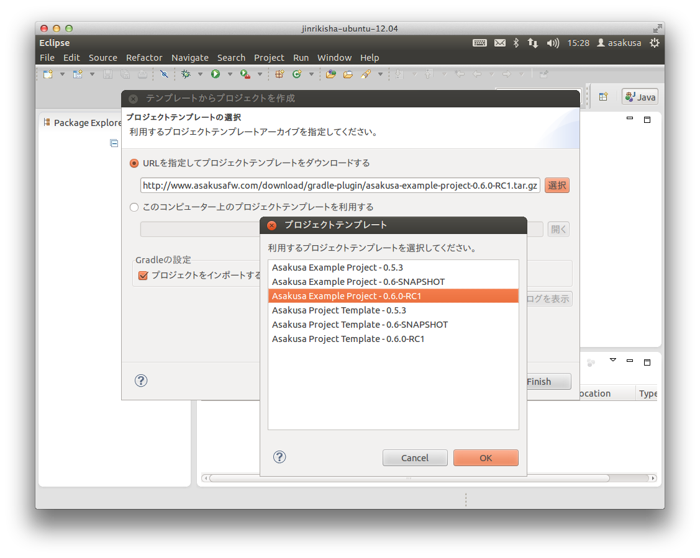
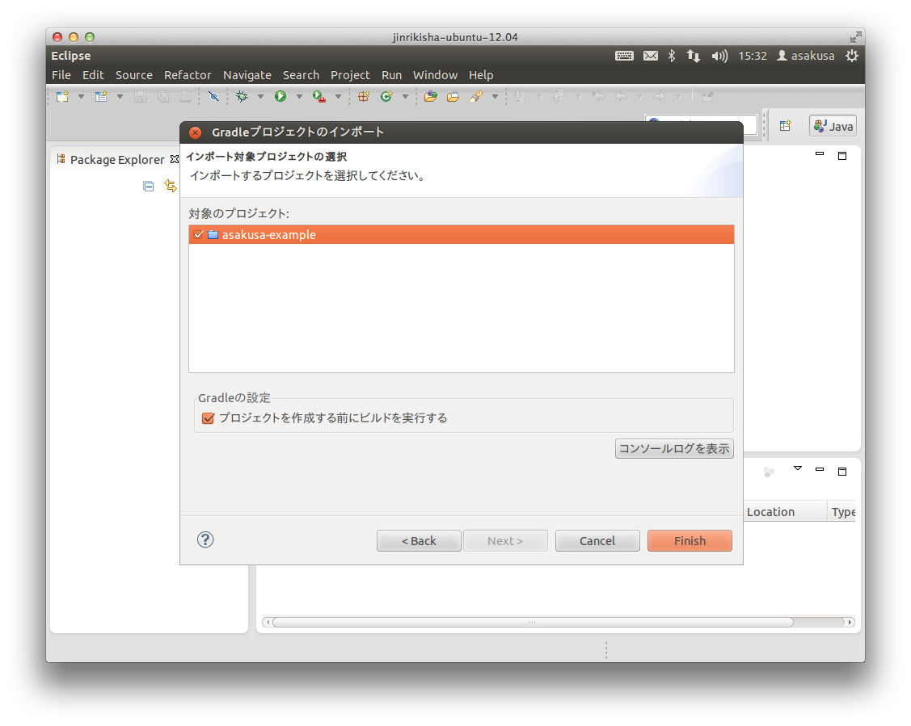
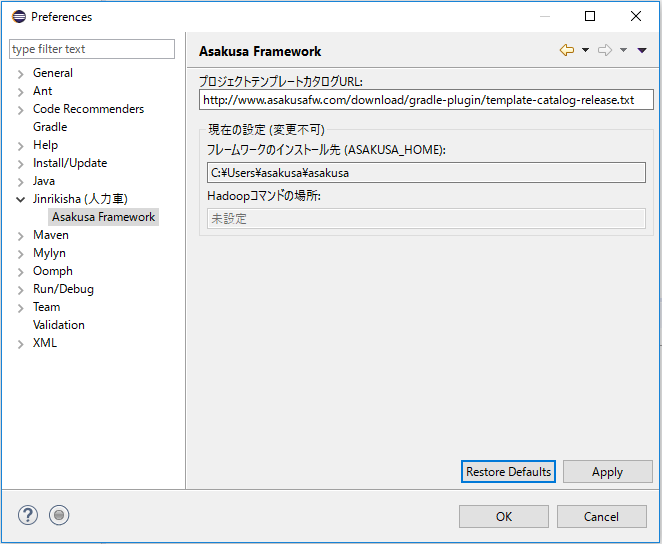

===================================================
Shafu - Asakusa Gradle Plug-in Helper for Eclipse -
===================================================

..  todo::
    この文書は作成中です。

Shafu (車夫) は、 `Asakusa Framework`_ のバッチアプリケーション開発をサポートするEclipseプラグインです。

Shafu は バッチアプリケーション開発にGradle (Asakusa Framework バージョン ``0.6.0`` から標準として採用されたビルドツール) を利用する際に、Eclipseから透過的にビルドツール上の操作を行えます。Shafuを使うことで、ターミナル上でのビルドツールの操作が不要となり、Eclipse上でアプリケーション開発に必要なほとんどの作業を行うことができるようになります。

Shafu は Jinrikisha でセットアップしたEclipse環境ではもちろんのこと、単体でセットアップしたEclipse上での利用も可能です。

..  _`Asakusa Framework`: http://asakusafw.s3.amazonaws.com/documents/latest/release/ja/html/index.html

対応プラットフォーム
====================
Shafuは以下のプラットフォームで動作を検証しています。

..  list-table::
    :widths: 2 3 2 3
    :header-rows: 1

    * - プラットフォーム
      - ソフトウェア
      - バージョン
      - 備考
    * - IDE
      - Eclipse
      - 3.7.2 / 4.3.1
      - 
    * - Java
      - Oracle JDK
      - JDK6 / JDK7
      - 推奨環境
    * - Java
      - Open JDK
      - JDK6 / JDK7
      - 基本的な動作確認のみ
    * - OS
      - Ubuntu Desktop (32bit/64bit)
      - 12.04
      - 推奨環境
    * - OS
      - CentOS (32bit/64bit)
      - 6.2
      - 
    * - OS
      - MacOSX
      - 10.7 / 10.9
      - 基本的な動作確認のみ [#]_

..  [#] MacOSXでJDK6を利用する場合、Eclipse実行時の文字エンコーディングをUTF-8などの日本語を利用できる環境にする必要があります。 `Eclipseの公式サイト`_ などを参考に、 ``eclipse.ini`` ファイルの ``-vmargs`` 以降の行に ``-Dfile.encoding=UTF-8`` の記述を追加してください。なおJinrikishaで構築した環境では環境変数 ``_JAVA_OPTIONS`` 経由で ``file.encoding`` が設定されるためこの設定は不要です。

..  _`Eclipseの公式サイト`: http://wiki.eclipse.org/Eclipse.ini

インストール
============
Shafu は次のアップデートサイトを使用してインストールすることができます。

* http://www.asakusafw.com/eclipse/jinrikisha/updates/

インストール手順
----------------
Eclipse上でShafu のアップデートサイトを利用したインストール手順例を説明します。

#. Eclipseのメニューから  ``[Help]`` - ``[Install New Software...]`` を選択します。
#. Installダイアログで ``[Work with:]`` の項目右の ``[Add]`` ボタンを押下します。
#. Add Repositoryダイアログで ``[Name:]`` に任意の名前(例: ``Jinrikisha`` )、 ``[Location:]`` に上記アップデートサイトのURLを入力して ``[OK]`` ボタンを押下します。
#. Installダイアログに表示された ``[Jinrikisha (人力車)]`` カテゴリを展開して ``[Asakusa Gradle プラグインサポート]`` を選択し、 ``[Next >]`` ボタンを押下します。
#. 以降、画面の指示に従いインストールを進めます。Eclipseの再起動を促されたら ``[Yes]`` を選択します。
#. Eclipse再起動が完了したら、Javaパースペクティブを表示して ``[Window]`` - ``[Reset Perspective..]`` を選択してJavaパースペクティブを初期化します。

使い方
======
Shafu が提供する各機能の使い方を説明します。

Gradleプロジェクトをテンプレートから生成
----------------------------------------
オンライン上に公開されているAsakusa Frameworkのプロジェクトテンプレートや、ローカルに配置したプロジェクトテンプレートを利用して、Eclipse上に新規プロジェクトを作成することができます。

#. Javaパースペクティブ上のメインメニューなどから ``[File]`` - ``[New]`` - ``[Gradleプロジェクトをテンプレートから生成]`` を選択します。
#. 新規プロジェクト情報ダイアログで、プロジェクト名などを入力します。
#. プロジェクトテンプレートの選択ダイアログで、オンラインまたはローカルのテンプレートファイルを指定します。URL入力ボックス右の ``[選択]`` ボタンを押すと、オンラインに公開されているプロジェクトテンプレートを一覧から選択することができます。
#. ``[Finish]`` ボタンを押すと選択したプロジェクトテンプレートを読み込み、Eclipseプロジェクトとして新規プロジェクトが作成されます。

Gradleプロジェクトのインポート
------------------------------
ローカルに配置したGradleベースのプロジェクトをEclipseワークスペース上にインポートすることができます。単体のプロジェクトをインポートするほか、複数のプロジェクトから構成されるマルチプロジェクト構成のプロジェクトを一括してインポートすることもできます。

#. Javaパースペクティブ上のメインメニューなどから ``[File]`` - ``[Import]`` を選択します。
#. インポート選択画面で ``[Jinrikisha (人力車)]`` - ``[Gradle プロジェクト]`` を選択して ``[Next >]`` ボタンを押します。
#. プロジェクトディレクトリーの選択ダイアログで、ローカルに配置されているGradleプロジェクトのディレクトリーパスを選択して ``[Next >]`` ボタンを押します。
#. インポート対象のプロジェクト選択で、インポート対象のプロジェクトを選択して ``[Finish]`` ボタンを押します。

プロジェクトのビルド
--------------------
プロジェクトのデータモデルクラスの生成やバッチコンパイルなど、Asakusa FrameworkがGradleを利用する各ビルド機能 [#]_ を実行することができます。

..  figure:: images/shafu-build-project.png
    :width: 100%

#. プロジェクトを選択してコンテキストメニュー(右クリックなどで表示されるメニュー)を表示します。
#. コンテキストメニューの ``[Jinrikisha (人力車)]`` を選択し、サブメニューとして表示される各ビルド機能を選択します。

``タスク名を指定してビルド``
  プロジェクトに対して任意のGradleタスクを実行することができます。以降で説明するShafuの標準メニュー以外のタスクはここから実行することができます。

``DMDLからデータモデルクラスを生成``
  DMDLスクリプトからデータモデルクラスを生成します。 Asakusa Gradle Pluginが提供する ``compileDMDL`` タスクを実行します。

``テストデータ・テンプレートを生成``
  DMDLスクリプトからTestDriverのテストデータを定義するExcelブックを生成します。 Asakusa Gradle Pluginが提供する ``generateTestbook`` タスクを実行します。

``Asakusaバッチアプリケーションを生成``
  Asakusa DSLをバッチコンパイルして、実行環境にデプロイするバッチアプリケーションアーカイブを生成します。Asakusa Gradle Pluginが提供する ``jarBatchapp`` タスクを実行します。

``Eclipseプロジェクト情報を再構成``
  Eclipseのプロジェクト定義ファイルを再作成します。プロジェクトにライブラリを追加した場合などに使用します。Asakusa Gradle Pluginが提供する ``eclipse`` タスクを実行します。

..  [#] Asakusa Frameworkが提供するGradle上のビルド機能についての詳細は、Asakusa Frameworkのドキュメント `Asakusa Gradle Plugin利用ガイド`_ を参照してください。

..  _`Asakusa Gradle Plugin利用ガイド`: http://asakusafw.s3.amazonaws.com/documents/latest/release/ja/html/application/gradle-plugin.html

設定
====
Shafu の設定画面からShafuの設定を変更することができます。

#. メインメニューから ``[Window]`` - ``[Preferences]`` を選択します。
#. プリファレンス画面のサイドメニューから ``[Jinrikisha  (人力車)]`` を選択します。

Jinrikisha (人力車) ページ
--------------------------

``基本``
  Gradleのログレベルやオフラインモードの設定など、Gradleの動作に関する設定を行います。

``プロジェクト``
  Gradleのプロジェクトビルド時に使用するプロジェクトプロパティーを設定することができます。

``Java VM``
  Gradleのビルドで使用するJava VMやJavaプロセスに対するシステムプロパティーを指定します。

Asakusa Framework ページ
~~~~~~~~~~~~~~~~~~~~~~~~

``テンプレートカタログURL``
  `Gradleプロジェクトをテンプレートから生成`_ でプロジェクトテンプレートを選択する際に使用する、プロジェクトテンプレートの一覧を定義したテンプレートカタログファイルを指定します。デフォルトでは Asakusa Frameworkが公開しているリリースバージョンの一覧を含むテンプレートカタログが指定されています。

..  note::
    Asakusa Frameworkが公開しているテスト用のバージョン (スナップショットビルドやRC版）を使用したい場合は、テンプレートカタログURLを以下のURLに変更します。

    http://www.asakusafw.com/download/gradle-plugin/template-catalog-develop.txt

ネットワークプロキシの設定
==========================
オンラインとの接続にプロキシサーバを経由する必要がある場合は、Eclipseのプロキシ設定画面でプロキシの設定を行います。

#. メインメニューから ``[Window]`` - ``[Preferences]`` を選択します。
#. プリファレンス画面のサイドメニューから ``[General]`` - ``[Network Connections]`` を選択します。
#. プロキシ設定画面で、Active Provider: を ``Manual`` に変更し、 Proxy entries や Proxy bypass の内容を編集して ``[OK]`` ボタンを押します。

